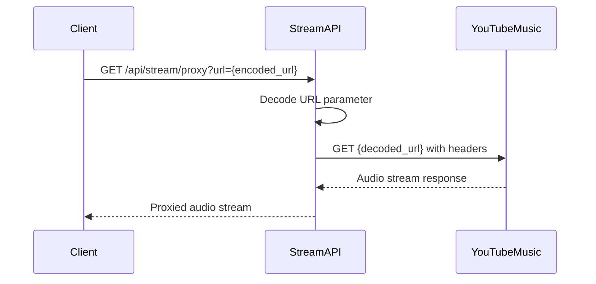

## Overview

The Stream API service provides audio streaming functionality through a proxy layer that handles media URL resolution and stream delivery for Beat App.

**Base URL**: `${STREAM_API}` (resolves to `${API_URL}/api/stream`)

**Configured in**: `src/constants.js`

## Configuration

```javascript src/constants.js
const API_URL = import.meta.env.VITE_API_URL || 'http://localhost:3000';
const STREAM_API = `${API_URL}/api/stream`;
const PROXY_URL = `${STREAM_API}/proxy?url=`;
```

<ParamField path="VITE_API_URL" type="string" default="http://localhost:3000">
  Base URL for API services. The Stream API is mounted at `/api/stream`.
</ParamField>

## Proxy Endpoint

### Stream Proxy

The primary streaming endpoint that proxies audio requests through the backend server.

**Endpoint**: `GET ${STREAM_API}/proxy`

<ParamField query="url" type="string" required>
  Encoded media URL to proxy. Typically a YouTube Music stream URL.
</ParamField>

**Response**: Binary audio stream (audio/mp4, audio/webm, etc.)

<CodeGroup>
```javascript Usage Example
import { PROXY_URL } from '@/constants';

// Construct proxied stream URL
const mediaUrl = 'https://rr1---sn-xxxx.googlevideo.com/videoplayback?...';
const streamUrl = `${PROXY_URL}${encodeURIComponent(mediaUrl)}`;

// Use in audio element
const audio = new Audio(streamUrl);
audio.play();
```

```javascript React Component Example
import { PROXY_URL } from '@/constants';
import { useRef, useEffect } from 'react';

function AudioPlayer({ trackStreamUrl }) {
  const audioRef = useRef(null);
  
  useEffect(() => {
    if (trackStreamUrl && audioRef.current) {
      const proxiedUrl = `${PROXY_URL}${encodeURIComponent(trackStreamUrl)}`;
      audioRef.current.src = proxiedUrl;
      audioRef.current.load();
    }
  }, [trackStreamUrl]);
  
  return (
    <audio 
      ref={audioRef}
      controls
      onError={(e) => console.error('Stream error:', e)}
    />
  );
}
```

```html HTML5 Audio Element
<audio controls>
  <source 
    src="http://localhost:3000/api/stream/proxy?url=https%3A%2F%2Frr1---sn-xxxx.googlevideo.com%2Fvideoplayback%3F..."
    type="audio/mp4"
  />
  Your browser does not support the audio element.
</audio>
```
</CodeGroup>

## Purpose & Architecture

### Why Proxy Streaming?

The Stream API proxy serves several critical functions:

1. **CORS Bypass**: YouTube Music stream URLs have strict CORS policies that prevent direct browser playback from different origins. The proxy server adds appropriate CORS headers.

2. **URL Expiration**: Direct stream URLs from YouTube Music expire quickly. The proxy can handle re-authentication and URL refresh transparently.

3. **Request Headers**: Stream requests require specific headers and authentication that can't be set from browser audio elements. The proxy manages these headers server-side.

4. **Rate Limiting**: Centralizes stream requests through a single endpoint, allowing for rate limiting and monitoring.

### Request Flow



## Response Headers

The proxy endpoint should set appropriate headers for streaming:

<ResponseField name="Content-Type" type="string">
  Media type of the audio stream (e.g., `audio/mp4`, `audio/webm`)
</ResponseField>

<ResponseField name="Accept-Ranges" type="string">
  Indicates server supports range requests (typically `bytes`)
</ResponseField>

<ResponseField name="Content-Length" type="string">
  Total size of the audio file in bytes
</ResponseField>

<ResponseField name="Access-Control-Allow-Origin" type="string">
  CORS header allowing browser access (e.g., `*` or specific origin)
</ResponseField>

<ResponseField name="Cache-Control" type="string">
  Caching directives for the stream
</ResponseField>

## Error Handling

### Common Error Scenarios

<Expandable title="Invalid or Missing URL Parameter">
  **HTTP 400 Bad Request**
  
  Returned when the `url` query parameter is missing or cannot be decoded.
  
  ```json
  {
    "error": "Missing or invalid url parameter"
  }
  ```
</Expandable>

<Expandable title="Upstream Stream Unavailable">
  **HTTP 502 Bad Gateway**
  
  Returned when the proxied URL is no longer valid or accessible.
  
  ```json
  {
    "error": "Failed to fetch stream from upstream source"
  }
  ```
  
  **Common causes:**
  - Stream URL has expired (typical after 6 hours)
  - Invalid or malformed stream URL
  - YouTube Music service disruption
</Expandable>

<Expandable title="Rate Limit Exceeded">
  **HTTP 429 Too Many Requests**
  
  Returned when client has exceeded request rate limits.
  
  ```json
  {
    "error": "Rate limit exceeded",
    "retryAfter": 60
  }
  ```
</Expandable>

### Client-Side Error Handling

```javascript
const audio = new Audio();

audio.addEventListener('error', (e) => {
  const error = audio.error;
  
  switch (error.code) {
    case MediaError.MEDIA_ERR_NETWORK:
      console.error('Network error while streaming');
      // Retry with exponential backoff
      break;
    case MediaError.MEDIA_ERR_DECODE:
      console.error('Error decoding audio stream');
      break;
    case MediaError.MEDIA_ERR_SRC_NOT_SUPPORTED:
      console.error('Stream format not supported');
      break;
    default:
      console.error('Unknown streaming error:', error);
  }
});

audio.src = `${PROXY_URL}${encodeURIComponent(streamUrl)}`;
```

## Performance Considerations

### Range Requests

The proxy should support HTTP range requests to enable:
- Seeking within tracks
- Efficient bandwidth usage
- Progressive loading

```javascript
// Browser automatically sends Range header when seeking
audio.currentTime = 60; // Seek to 1 minute
// Request: Range: bytes=2000000-
```

### Caching Strategy

While stream URLs expire, partial caching can improve performance:

- **Short-term cache**: 5-10 minutes for active streams
- **CDN edge caching**: For popular tracks
- **Client-side buffering**: Browser handles automatically

### Streaming Protocols

YouTube Music typically provides:
- **Adaptive formats**: Multiple quality levels
- **Codecs**: AAC (audio/mp4), Opus (audio/webm)
- **Bitrates**: 128kbps to 256kbps

## Security Considerations

### URL Validation

The proxy server should validate that URLs:
- Point to legitimate YouTube Music domains
- Don't attempt to proxy arbitrary external URLs
- Include proper authentication tokens

```javascript
// Server-side validation example
function isValidStreamUrl(url) {
  try {
    const parsed = new URL(url);
    const allowedHosts = [
      'googlevideo.com',
      'youtube.com',
      'ytimg.com'
    ];
    return allowedHosts.some(host => parsed.hostname.endsWith(host));
  } catch {
    return false;
  }
}
```

### Rate Limiting

Implement rate limiting to prevent abuse:
- Per-IP limits: 100 requests per minute
- Per-user limits: 500 requests per hour
- Concurrent stream limits: 3 simultaneous streams

## Integration with YouTube API

The Stream API works in conjunction with the YouTube API service:

1. **Get track metadata** via YouTube API (see [YouTube API docs](/api/youtube-api))
2. **Extract stream URL** from track data
3. **Proxy stream** through Stream API
4. **Play audio** in browser

```javascript
import { searchTracks } from '@/services/youtube-api';
import { PROXY_URL } from '@/constants';

// 1. Search for track
const { tracks } = await searchTracks('never gonna give you up');
const track = tracks[0];

// 2. Get stream URL (would come from additional API call)
const streamUrl = await getTrackStreamUrl(track.trackId);

// 3. Proxy and play
const audio = new Audio(`${PROXY_URL}${encodeURIComponent(streamUrl)}`);
audio.play();
```

## Environment Variables

<ParamField path="VITE_API_URL" type="string" default="http://localhost:3000">
  Base URL for the API server hosting the stream proxy
</ParamField>

## Best Practices

1. **Always encode URLs**: Use `encodeURIComponent()` when constructing proxy URLs
2. **Handle errors gracefully**: Implement retry logic for network failures
3. **Preload next track**: Start loading the next track 10-15 seconds before current ends
4. **Monitor stream health**: Track buffering events and error rates
5. **Implement fallbacks**: Have alternative quality streams available

## Example: Complete Audio Player

```javascript
import { PROXY_URL } from '@/constants';

class StreamPlayer {
  constructor() {
    this.audio = new Audio();
    this.setupEventListeners();
  }
  
  setupEventListeners() {
    this.audio.addEventListener('error', this.handleError.bind(this));
    this.audio.addEventListener('waiting', () => console.log('Buffering...'));
    this.audio.addEventListener('canplay', () => console.log('Ready to play'));
    this.audio.addEventListener('ended', () => this.playNext());
  }
  
  async playTrack(streamUrl) {
    try {
      const proxiedUrl = `${PROXY_URL}${encodeURIComponent(streamUrl)}`;
      this.audio.src = proxiedUrl;
      await this.audio.play();
    } catch (error) {
      console.error('Playback failed:', error);
      this.handleError(error);
    }
  }
  
  handleError(error) {
    // Implement retry logic
    console.error('Stream error:', error);
    // Could fetch a new stream URL and retry
  }
  
  playNext() {
    // Implement queue logic
  }
}

const player = new StreamPlayer();
export default player;
```

## Related Documentation

<CardGroup cols={2}>
  <Card title="YouTube API" icon="magnifying-glass" href="/api/youtube-api">
    Get track metadata and stream URLs
  </Card>
  <Card title="API Overview" icon="book" href="/api/overview">
    Backend architecture overview
  </Card>
</CardGroup>