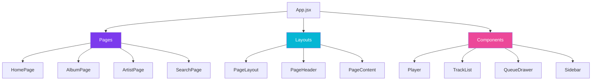
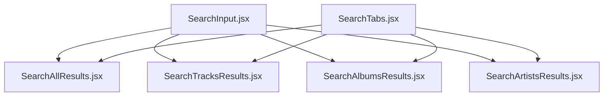

Beat App follows a modular component architecture with clear separation between page-level containers, reusable UI components, and layout wrappers. This guide explores the component hierarchy and design patterns used throughout the application.

## Component Categories

Components are organized into three primary categories:



<CardGroup cols={3}>
  <Card title="Pages" icon="file">
    Route-level components that handle data fetching and composition
  </Card>
  <Card title="Layouts" icon="table-layout">
    Reusable page structure wrappers
  </Card>
  <Card title="Components" icon="cube">
    Presentational UI components
  </Card>
</CardGroup>

## Directory Structure

```text
src/
├── components/              # Reusable UI components
│   ├── Player.jsx          # Audio player controls
│   ├── QueueDrawer.jsx     # Playback queue sidebar
│   ├── TrackList.jsx       # Track listing with play controls
│   ├── Sidebar.jsx         # Main navigation sidebar
│   ├── SearchInput.jsx     # Search bar component
│   ├── SearchTabs.jsx      # Search result tabs
│   ├── SearchAllResults.jsx
│   ├── SearchTracksResults.jsx
│   ├── SearchAlbumsResults.jsx
│   ├── SearchArtistsResults.jsx
│   ├── AlbumGrid.jsx       # Grid layout for albums
│   ├── Charts.jsx          # Charts display component
│   ├── HorizontalScroll.jsx # Horizontal scrolling container
│   └── EqualizerIcon/      # Animated equalizer icon
│       └── EqualizerIcon.jsx
├── layouts/                 # Page layout wrappers
│   ├── PageLayout.jsx      # Standard page wrapper
│   ├── PageHeader.jsx      # Page header with title/actions
│   └── PageContent.jsx     # Page content container
└── pages/                   # Route-level page components
    ├── HomePage.jsx        # Landing page
    ├── ExplorePage.jsx     # Explore/discover page
    ├── ChartsPage.jsx      # Music charts
    ├── LibraryPage.jsx     # User library
    ├── SearchPage.jsx      # Search landing
    ├── SearchAllPage.jsx   # All search results
    ├── SearchTracksPage.jsx
    ├── SearchAlbumsPage.jsx
    ├── SearchArtistsPage.jsx
    ├── AlbumPage.jsx       # Album detail view
    ├── ArtistPage.jsx      # Artist detail view
    └── ArtistAlbumsPage.jsx # Artist's albums list
```

## Core Components

### App Component

The root `App.jsx` establishes the application shell with persistent UI elements:

```jsx
import { Outlet } from "react-router-dom";
import Player from "./components/Player";
import QueueDrawer from "./components/QueueDrawer";
import Sidebar from "./components/Sidebar";

function App() {
  return (
    <Box sx={{ display: "flex", height: "100vh" }}>
      {/* Sidebar - persistent across routes */}
      <Sidebar mobileOpen={mobileOpen} onMobileToggle={handleMobileToggle} />

      <Box sx={{ display: "flex", flexDirection: "column", flexGrow: 1 }}>
        {/* Top bar with search */}
        <Box component="header">
          <SearchInput />
          <IconButton onClick={toggleTheme}>
            {isDarkMode ? <LightModeIcon /> : <DarkModeIcon />}
          </IconButton>
        </Box>

        {/* Main content area */}
        <Box sx={{ display: "flex", flexGrow: 1 }}>
          <Box component="main">
            <Outlet /> {/* Route content renders here */}
          </Box>
          <QueueDrawer /> {/* Queue drawer */}
        </Box>

        {/* Player bar - persistent across routes */}
        <Box className="player-container">
          <Player />
        </Box>
      </Box>
    </Box>
  );
}
```

<Info>
Location: `src/App.jsx`
</Info>

### Layout Components

#### PageLayout

Provides consistent page structure:

```jsx
import PageLayout from '../layouts/PageLayout';

function MyPage() {
  return (
    <PageLayout>
      <PageHeader title="My Page" />
      <PageContent>
        {/* Page content here */}
      </PageContent>
    </PageLayout>
  );
}
```

<AccordionGroup>
  <Accordion title="PageLayout">
    Main page wrapper that provides:
    - Consistent padding and spacing
    - Responsive layout adjustments
    - Background styling
    
    Location: `src/layouts/PageLayout.jsx`
  </Accordion>
  
  <Accordion title="PageHeader">
    Page header component with:
    - Page title
    - Action buttons (play all, shuffle, etc.)
    - Optional metadata display
    
    Location: `src/layouts/PageHeader.jsx`
  </Accordion>
  
  <Accordion title="PageContent">
    Content area wrapper providing:
    - Scrollable content region
    - Proper spacing
    - Responsive behavior
    
    Location: `src/layouts/PageContent.jsx`
  </Accordion>
</AccordionGroup>

## Player Component

The `Player` component is the heart of the audio experience, connecting store state with UI controls:

```jsx
import { useStore } from "@nanostores/react";
import { playerStore, playerActions } from "../stores/playerStore";

export default function Player() {
  const { isPlaying, duration, currentTime, currentTrack, isLoading } =
    useStore(playerStore);

  const [muted, setMuted] = useState(false);
  const [volume, setVolume] = useState(100);
  const [liked, setLiked] = useState(false);

  // Sync volume with audio element
  useEffect(() => {
    audioEl.volume = volume / 100;
  }, [volume]);

  // Check like status when track changes
  useEffect(() => {
    if (currentTrack?.trackId) {
      isLiked(currentTrack.trackId).then(setLiked);
      addRecentPlay(currentTrack);
    }
  }, [currentTrack?.trackId]);

  return (
    <div className="player-bar">
      {/* Track info with album art */}
      <div className="track-info">
        <Box sx={{ width: 56, height: 56 }}>
          
        </Box>
        <Box>
          <p>{currentTrack?.title}</p>
          <p>{currentTrack?.artists[0]?.name}</p>
        </Box>
        <IconButton onClick={handleToggleLike}>
          {liked ? <FavoriteRounded /> : <FavoriteBorderRounded />}
        </IconButton>
      </div>

      {/* Playback controls */}
      <div className="buttons-and-progress">
        <IconButton onClick={playerActions.playPrevious}>
          <SkipPreviousRounded />
        </IconButton>
        <IconButton onClick={playerActions.togglePause}>
          {isLoading ? <CircularProgress /> :
           isPlaying ? <PauseRounded /> : <PlayArrowRounded />}
        </IconButton>
        <IconButton onClick={playerActions.playNext}>
          <SkipNextRounded />
        </IconButton>
        
        {/* Progress bar */}
        <Slider
          value={currentTime * 5}
          max={duration * 5}
          onChange={(_, value) => playerActions.seekTo(value / 5)}
        />
      </div>

      {/* Volume controls */}
      <div className="volume-and-others">
        <IconButton onClick={() => setMuted(!muted)}>
          <VolumeUpRounded />
        </IconButton>
        <Slider value={volume} onChange={(_, v) => setVolume(v)} />
        <IconButton onClick={playerActions.toggleQueue}>
          <QueueMusicRounded />
        </IconButton>
      </div>
    </div>
  );
}
```

<Info>
Location: `src/components/Player.jsx`
</Info>

### Player Features

<CardGroup cols={2}>
  <Card title="Playback Controls" icon="play">
    Play, pause, next, previous with loading states
  </Card>
  <Card title="Progress Tracking" icon="clock">
    Real-time progress bar with seek functionality
  </Card>
  <Card title="Volume Control" icon="volume-high">
    Volume slider and mute toggle
  </Card>
  <Card title="Track Metadata" icon="music">
    Album art, title, artist with like button
  </Card>
</CardGroup>

## TrackList Component

Displays a list of tracks with play functionality:

```jsx
import { useStore } from "@nanostores/react";
import { playerStore, playerActions } from "../stores/playerStore";

export default function TrackList({ tracks, hideImage, hideAlbum }) {
  const { currentTrack, isPlaying, isLoading } = useStore(playerStore);

  const playTrackItem = (track) => {
    playerActions.playTrack(track, tracks);
  };

  return (
    <Box>
      {/* Header row */}
      <Box className="track-list-header">
        <Box>#</Box>
        <Box>Title</Box>
        {!hideAlbum && <Box>Album</Box>}
        <Box>Duration</Box>
      </Box>

      {/* Track rows */}
      <List>
        {tracks.map((item, index) => (
          <ListItem onClick={() => playTrackItem(item)}>
            {/* Track index or equalizer */}
            <Box>
              {currentTrack?.trackId === item.trackId ? (
                isLoading ? <CircularProgress /> :
                isPlaying ? <EqualizerIcon /> :
                index + 1
              ) : (
                index + 1
              )}
            </Box>

            {/* Track info */}
            <Box sx={{ display: "flex" }}>
              {!hideImage && (
                <Avatar src={`${PROXY_URL}${item.thumbnailUrl}`} />
              )}
              <ListItemText
                primary={item.title}
                secondary={
                  item.artists.map((artist) => (
                    <Link to={`/artist/${artist.id}`}>
                      {artist.name}
                    </Link>
                  ))
                }
              />
            </Box>

            {/* Album link */}
            {!hideAlbum && (
              <Link to={`/album/${item.album.albumId}`}>
                {item.album.title}
              </Link>
            )}

            {/* Duration */}
            <Box>{item.duration.label}</Box>
          </ListItem>
        ))}
      </List>
    </Box>
  );
}
```

<Info>
Location: `src/components/TrackList.jsx`
</Info>

### TrackList Features

- Grid-based layout with proper column alignment
- Active track highlighting with animated equalizer
- Click-to-play functionality
- Artist and album navigation links
- Configurable display options (`hideImage`, `hideAlbum`)
- Responsive design for mobile/desktop

## QueueDrawer Component

Displays the playback queue in a collapsible drawer:

```jsx
import { useStore } from "@nanostores/react";
import { playerStore, playerActions } from "../stores/playerStore";

function QueueDrawer() {
  const { isQueueOpen, queue, currentTrackIndex, queueDrawerWidth } = 
    useStore(playerStore);

  return (
    <Drawer
      anchor="right"
      variant="persistent"
      open={isQueueOpen}
      sx={{ width: isQueueOpen ? queueDrawerWidth : 0 }}
    >
      <Typography variant="h6">Queue</Typography>
      <List>
        {queue.map((track, index) => (
          <ListItem
            onClick={() => playerActions.playTrack(track)}
            sx={{
              backgroundColor:
                currentTrackIndex === index ? "action.selected" : "transparent",
              ...(currentTrackIndex === index && {
                borderLeft: "3px solid",
                borderImage: "linear-gradient(135deg, #7c3aed, #06b6d4) 1",
              }),
            }}
          >
            <ListItemText
              primary={track.title}
              secondary={track.artists[0]?.name}
            />
          </ListItem>
        ))}
      </List>
    </Drawer>
  );
}
```

<Info>
Location: `src/components/QueueDrawer.jsx`
</Info>

### Queue Features

- Persistent drawer that opens/closes via player toggle
- Highlights currently playing track
- Click any track to jump to it
- Gradient border accent on active track
- Hidden on mobile devices

## Search Components

Search functionality is split across multiple specialized components:



### Component Responsibilities

| Component | Purpose |
|-----------|----------|
| **SearchInput** | Global search bar in header, handles query submission |
| **SearchTabs** | Tab navigation between result types (All, Tracks, Albums, Artists) |
| **SearchAllResults** | Combined view showing all result types |
| **SearchTracksResults** | Track-specific results with TrackList |
| **SearchAlbumsResults** | Album grid results |
| **SearchArtistsResults** | Artist card results |

<Note>
All search components consume `searchStore` to sync query and active tab state.
</Note>

## Sidebar Component

The main navigation sidebar with responsive mobile support:

```jsx
function Sidebar({ mobileOpen, onMobileToggle }) {
  return (
    <>
      {/* Mobile drawer */}
      <Drawer
        variant="temporary"
        open={mobileOpen}
        onClose={onMobileToggle}
        sx={{ display: { xs: "block", sm: "none" } }}
      >
        <SidebarContent />
      </Drawer>

      {/* Desktop permanent drawer */}
      <Drawer
        variant="permanent"
        sx={{ display: { xs: "none", sm: "block" } }}
      >
        <SidebarContent />
      </Drawer>
    </>
  );
}

function SidebarContent() {
  return (
    <Box sx={{ width: SIDEBAR_WIDTH }}>
      <List>
        <ListItem component={Link} to="/">
          <ListItemIcon><HomeIcon /></ListItemIcon>
          <ListItemText primary="Home" />
        </ListItem>
        <ListItem component={Link} to="/explore">
          <ListItemIcon><ExploreIcon /></ListItemIcon>
          <ListItemText primary="Explore" />
        </ListItem>
        {/* More navigation items */}
      </List>
    </Box>
  );
}
```

<Info>
Location: `src/components/Sidebar.jsx`
</Info>

## Component Communication Patterns

### 1. Store-based Communication

Components communicate via shared stores:

```jsx
// TrackList updates store
function TrackList({ tracks }) {
  const playTrack = (track) => {
    playerActions.playTrack(track, tracks);
  };
}

// Player reacts to store changes
function Player() {
  const { currentTrack } = useStore(playerStore);
  return <div>{currentTrack?.title}</div>;
}
```

### 2. Props-based Communication

Parent-to-child data flow:

```jsx
function AlbumPage() {
  const [tracks, setTracks] = useState([]);
  
  return <TrackList tracks={tracks} hideAlbum />;
}
```

### 3. Event-based Communication

Child-to-parent callbacks:

```jsx
function App() {
  const [mobileOpen, setMobileOpen] = useState(false);
  
  return (
    <Sidebar 
      mobileOpen={mobileOpen} 
      onMobileToggle={() => setMobileOpen(!mobileOpen)} 
    />
  );
}
```

## Styling Approach

Beat App uses Material-UI's `sx` prop for component styling:

```jsx
<Box
  sx={{
    display: "flex",
    flexDirection: "column",
    gap: 2,
    p: 3,
    bgcolor: "background.paper",
    borderRadius: 2,
    // Responsive styles
    px: { xs: 1.5, sm: 3 },
  }}
>
  {/* Content */}
</Box>
```

### Styling Benefits

<CardGroup cols={2}>
  <Card title="Theme Integration" icon="palette">
    Automatic light/dark mode support via theme tokens
  </Card>
  <Card title="Responsive Design" icon="mobile">
    Breakpoint-based responsive values
  </Card>
  <Card title="Type Safety" icon="shield">
    TypeScript-aware style definitions
  </Card>
  <Card title="Performance" icon="gauge">
    CSS-in-JS with optimized runtime
  </Card>
</CardGroup>

## Shared Utilities

### Audio Element

A singleton audio element shared across components:

```javascript
// src/audioEl.js
const audioEl = new Audio();
export default audioEl;
```

Imported by:
- `playerStore.js` - Event listeners and playback control
- `Player.jsx` - Volume control sync

### IndexedDB Utils

Local storage utilities for user data:

```javascript
// src/lib/idb.js
export async function isLiked(trackId) { ... }
export async function toggleLike(track) { ... }
export async function addRecentPlay(track) { ... }
```

Used in:
- `Player.jsx` - Like button functionality
- `LibraryPage.jsx` - Display liked tracks

## Component Best Practices

<AccordionGroup>
  <Accordion title="Single Responsibility">
    Each component should have one clear purpose:
    
    - `Player` handles playback controls
    - `TrackList` displays tracks
    - `QueueDrawer` shows the queue
    
    Avoid creating "god components" that do everything.
  </Accordion>
  
  <Accordion title="Composition Over Inheritance">
    Build complex UIs by composing simple components:
    
    ```jsx
    <PageLayout>
      <PageHeader title="Album" />
      <PageContent>
        <TrackList tracks={tracks} />
      </PageContent>
    </PageLayout>
    ```
  </Accordion>
  
  <Accordion title="Controlled vs Uncontrolled">
    Prefer controlled components for better state management:
    
    ```jsx
    // Controlled - state managed by parent
    <Slider value={volume} onChange={setVolume} />
    
    // Uncontrolled - internal state
    <Slider defaultValue={50} />
    ```
  </Accordion>
  
  <Accordion title="Prop Validation">
    Use TypeScript or PropTypes to validate component props:
    
    ```jsx
    TrackList.propTypes = {
      tracks: PropTypes.arrayOf(PropTypes.object).isRequired,
      hideImage: PropTypes.bool,
      hideAlbum: PropTypes.bool,
    };
    ```
  </Accordion>
</AccordionGroup>

## Next Steps

<CardGroup cols={2}>
  <Card title="Architecture Overview" icon="sitemap" href="/architecture/overview">
    Understand the overall system architecture
  </Card>
  <Card title="State Management" icon="database" href="/architecture/state-management">
    Deep dive into Nanostores implementation
  </Card>
</CardGroup>