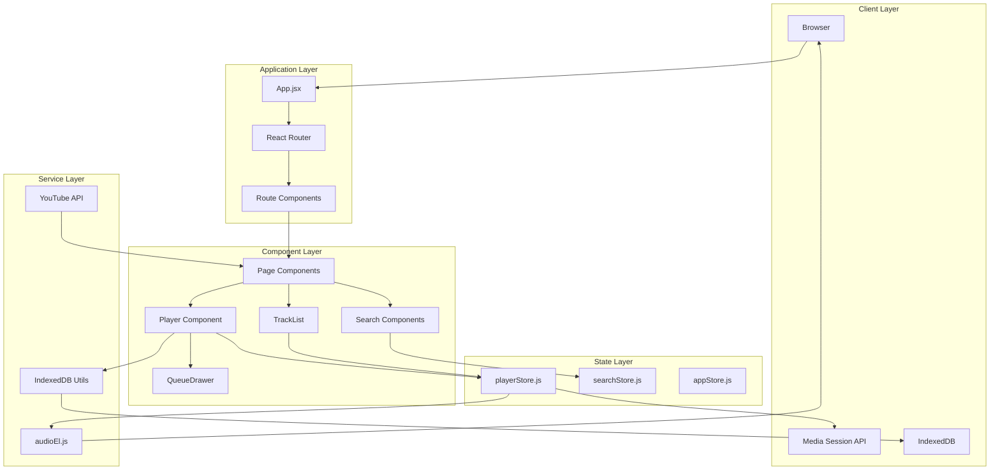
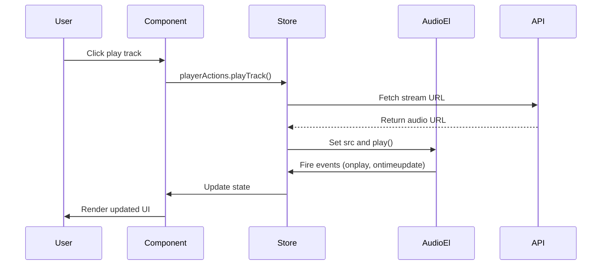

Beat App is built as a modern single-page application using React 18, Vite, and a reactive state management approach with Nanostores. The architecture emphasizes component reusability, clean separation of concerns, and efficient state synchronization.

## Technology Stack

<CardGroup cols={2}>
  <Card title="Frontend Framework" icon="react">
    React 18 with Vite for fast builds and hot module replacement
  </Card>
  <Card title="Routing" icon="route">
    React Router DOM for declarative client-side routing
  </Card>
  <Card title="UI Library" icon="palette">
    Material-UI (MUI) with Emotion for styling
  </Card>
  <Card title="State Management" icon="database">
    Nanostores for lightweight, reactive global state
  </Card>
</CardGroup>

## System Architecture



## Project Structure

<Info>
All source code is organized under the `src/` directory with clear separation by concern.
</Info>

```text
src/
├── assets/             # Images and static assets
├── components/         # Reusable UI components
│   ├── Player.jsx
│   ├── QueueDrawer.jsx
│   ├── TrackList.jsx
│   ├── Sidebar.jsx
│   ├── SearchInput.jsx
│   └── ...
├── hooks/              # Custom React hooks
├── layouts/            # Page layout wrappers
│   ├── PageLayout.jsx
│   ├── PageHeader.jsx
│   └── PageContent.jsx
├── pages/              # Route-level page components
│   ├── HomePage.jsx
│   ├── AlbumPage.jsx
│   ├── ArtistPage.jsx
│   ├── SearchPage.jsx
│   └── ...
├── services/           # External API communication
│   └── youtube-api.js
├── stores/             # Nanostores state management
│   ├── playerStore.js
│   ├── searchStore.js
│   └── appStore.js
├── lib/                # Utility libraries
│   └── idb.js          # IndexedDB wrapper
├── App.jsx             # Root application component
├── main.jsx            # React entry point
├── audioEl.js          # Shared HTMLAudioElement
├── routes.jsx          # Application routing configuration
└── constants.js        # Application constants
```

## Core Design Patterns

### 1. Container/Presentational Pattern

Components are organized into smart containers (pages) and presentational components:

- **Pages** (`src/pages/`): Handle data fetching, routing params, and business logic
- **Components** (`src/components/`): Receive props and render UI, accessing stores when needed

### 2. Reactive State Management

Nanostores provide a lightweight pub/sub pattern where components subscribe to specific state slices:

```jsx
import { useStore } from '@nanostores/react';
import { playerStore } from '../stores/playerStore';

function Player() {
  const { isPlaying, currentTrack } = useStore(playerStore);
  // Component automatically re-renders when these values change
}
```

### 3. Shared Audio Element

A single `HTMLAudioElement` instance (`src/audioEl.js`) is shared across the application to maintain consistent playback state:

```javascript
const audioEl = new Audio();
export default audioEl;
```

This approach ensures:
- Single source of truth for playback
- Efficient memory usage
- Consistent event handling

### 4. Media Session Integration

The player integrates with the browser's Media Session API to provide native OS-level controls:

<Note>
See `src/stores/playerStore.js:209-221` for the Media Session API implementation
</Note>

## Data Flow



### User Interaction Flow

1. User interacts with UI (clicks play, adds to queue, etc.)
2. Component calls an action from the appropriate store
3. Store updates state and triggers side effects (API calls, audio playback)
4. Audio element fires events that update store state
5. Components subscribed to the store automatically re-render

## Key Features

<AccordionGroup>
  <Accordion title="Music Playback & Streaming">
    Audio streaming is handled through a custom API proxy system. Track URLs are fetched from the YouTube API and proxied to avoid CORS issues. The `audioEl.js` singleton manages playback state.
  </Accordion>
  
  <Accordion title="Queue Management">
    The playback queue is managed entirely in `playerStore.js`. Users can:
    - Add tracks to the end of the queue
    - Play next (insert after current track)
    - View and navigate the queue via `QueueDrawer`
  </Accordion>
  
  <Accordion title="Search System">
    Multi-faceted search allows users to find:
    - Tracks
    - Albums
    - Artists
    
    Search state is managed in `searchStore.js` with dedicated result components for each type.
  </Accordion>
  
  <Accordion title="Persistent Data">
    IndexedDB stores user data locally:
    - Liked tracks
    - Recently played songs
    - Playback history
    
    See `src/lib/idb.js` for the storage implementation.
  </Accordion>
</AccordionGroup>

## Routing Architecture

The application uses a nested routing structure defined in `src/routes.jsx`:

```jsx
[
  {
    path: "/",
    element: <App />,
    children: [
      { index: true, element: <HomePage /> },
      { path: "explore", element: <ExplorePage /> },
      { path: "charts", element: <ChartsPage /> },
      { path: "library", element: <LibraryPage /> },
      { path: "search/:query", element: <SearchAllPage /> },
      { path: "album/:albumId", element: <AlbumPage /> },
      { path: "artist/:artistId", element: <ArtistPage /> },
      // ...
    ]
  }
]
```

<Info>
All routes render inside the `<Outlet />` in `App.jsx`, maintaining the persistent player and navigation.
</Info>

## Layout System

The `App.jsx` component establishes a fixed layout structure:

```jsx
<Box sx={{ display: "flex", height: "100vh" }}>
  <Sidebar />                    {/* Left navigation */}
  <Box sx={{ flexGrow: 1 }}>
    <Header />                   {/* Top bar with search */}
    <Box sx={{ display: "flex" }}>
      <Outlet />                 {/* Page content */}
      <QueueDrawer />            {/* Right drawer */}
    </Box>
    <Player />                   {/* Bottom player bar */}
  </Box>
</Box>
```

This ensures the Player, Sidebar, and Queue remain visible across all routes.

## Next Steps

<CardGroup cols={2}>
  <Card title="State Management" icon="database" href="/architecture/state-management">
    Learn how Nanostores power reactive state
  </Card>
  <Card title="Component Structure" icon="cube" href="/architecture/components">
    Explore the component hierarchy and patterns
  </Card>
</CardGroup>