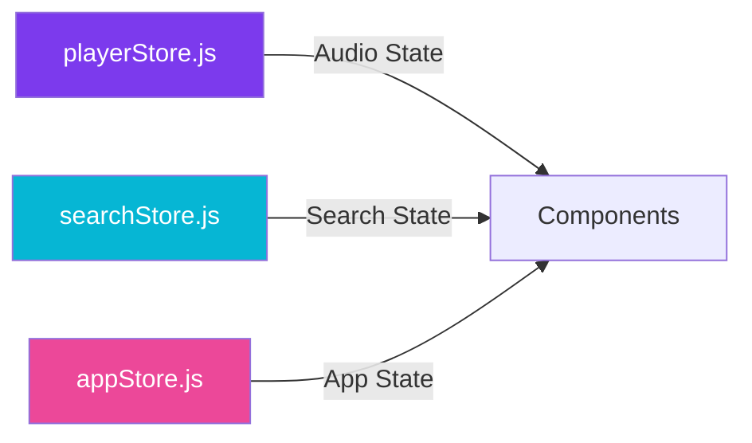
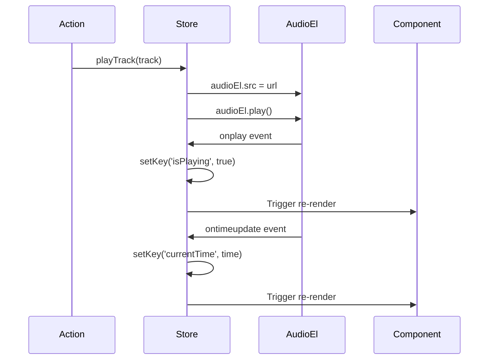

Beat App uses [Nanostores](https://github.com/nanostores/nanostores) for state management—a tiny (less than 1 KB) state manager with excellent TypeScript support and framework-agnostic design. Nanostores provide a simple, performant alternative to Redux or Zustand.

## Why Nanostores?

<CardGroup cols={2}>
  <Card title="Tiny Bundle Size" icon="feather">
    Less than 1 KB - minimal impact on app performance
  </Card>
  <Card title="Simple API" icon="code">
    Easy to learn with `map()` and `atom()` primitives
  </Card>
  <Card title="Framework Agnostic" icon="plug">
    Works with React, Vue, Svelte, or vanilla JS
  </Card>
  <Card title="TypeScript First" icon="shield-check">
    Excellent type inference and safety
  </Card>
</CardGroup>

## Store Architecture

Beat App uses three primary stores located in `src/stores/`:



### Store Responsibilities

| Store | File | Purpose |
|-------|------|----------|
| **playerStore** | `src/stores/playerStore.js` | Manages playback state, queue, current track, and audio element events |
| **searchStore** | `src/stores/searchStore.js` | Tracks search query and active search tab |
| **appStore** | `src/stores/appStore.js` | Global application state like WebSocket readiness |

## Player Store

The `playerStore` is the most complex store, managing all audio playback logic.

### Store Definition

```javascript
import { map, onMount } from "nanostores";
import audioEl from "../audioEl";

const initialState = {
  isPlaying: false,
  currentTrackIndex: -1,
  currentTrack: null,
  queue: [],
  isLoading: false,
  currentTime: 0,
  duration: 0,
  isQueueOpen: false,
  queueDrawerWidth: 0,
};

export const playerStore = map(initialState);
```

<Info>
Location: `src/stores/playerStore.js:33-46`
</Info>

### Store State Shape

<AccordionGroup>
  <Accordion title="Playback State">
    - `isPlaying`: Boolean indicating if audio is currently playing
    - `isLoading`: Boolean for buffering/loading states
    - `currentTime`: Current playback position in seconds
    - `duration`: Total track duration in seconds
  </Accordion>
  
  <Accordion title="Track & Queue State">
    - `currentTrack`: Object containing track metadata (title, artists, thumbnailUrl, etc.)
    - `currentTrackIndex`: Index of current track in queue
    - `queue`: Array of track objects representing playback queue
  </Accordion>
  
  <Accordion title="UI State">
    - `isQueueOpen`: Boolean controlling queue drawer visibility
    - `queueDrawerWidth`: Pixel width of queue drawer (0 when closed, 300 when open)
  </Accordion>
</AccordionGroup>

## Actions Pattern

Nanostores don't have built-in actions, so Beat App uses a plain object export pattern:

```javascript
export const playerActions = {
  toggleQueue: () => {
    const state = playerStore.get();
    playerStore.setKey("isQueueOpen", !state.isQueueOpen);
    playerStore.setKey("queueDrawerWidth", state.isQueueOpen ? 0 : 300);
  },

  togglePause: () => {
    if (audioEl.paused) audioEl.play();
    else audioEl.pause();
  },

  playTrack: async (track, newQueue = null) => {
    playerStore.setKey("currentTrack", track);
    playerStore.setKey("isLoading", true);

    if (newQueue) {
      playerStore.setKey("queue", newQueue);
    }

    const state = playerStore.get();
    const trackIndex = state.queue.findIndex(
      (t) => t.trackId === track.trackId
    );

    audioEl.pause();
    updateMediaSessionMetadata(track);

    if (trackIndex !== -1) {
      playerStore.setKey("currentTrackIndex", trackIndex);
      const audioUrl = await getAudioUrl(track.trackId);
      audioEl.src = audioUrl;
      audioEl.play();
    } else {
      const audioUrl = await getAudioUrl(track.trackId);
      audioEl.src = audioUrl;
      playerStore.setKey("currentTrackIndex", 0);
      playerStore.setKey("queue", [track]);
      audioEl.play();
    }
  },
  
  // Additional actions: playNext, playPrevious, addToQueue, etc.
};
```

<Info>
Location: `src/stores/playerStore.js:49-159`
</Info>

### Key Actions

| Action | Purpose | Example |
|--------|---------|----------|
| `toggleQueue()` | Open/close queue drawer | `playerActions.toggleQueue()` |
| `togglePause()` | Play or pause current track | `playerActions.togglePause()` |
| `playTrack(track, queue?)` | Play a specific track with optional new queue | `playerActions.playTrack(track, tracks)` |
| `playNext()` | Skip to next track in queue | `playerActions.playNext()` |
| `playPrevious()` | Go to previous track | `playerActions.playPrevious()` |
| `addToQueue(track)` | Add track to end of queue | `playerActions.addToQueue(track)` |
| `addToQueueNext(track)` | Insert track after current | `playerActions.addToQueueNext(track)` |
| `seekTo(time)` | Seek to specific timestamp | `playerActions.seekTo(45)` |

## Audio Element Integration

The `playerStore` uses Nanostores' `onMount` lifecycle to set up audio element event listeners:

```javascript
import { onMount } from "nanostores";

onMount(playerStore, () => {
  audioEl.onended = () => {
    playerActions.playNext();
  };

  audioEl.onplay = () => {
    playerStore.setKey("isPlaying", true);
    if ("mediaSession" in navigator) {
      navigator.mediaSession.playbackState = "playing";
    }
  };

  audioEl.onpause = () => {
    playerStore.setKey("isPlaying", false);
    if ("mediaSession" in navigator) {
      navigator.mediaSession.playbackState = "paused";
    }
  };

  audioEl.ontimeupdate = () => {
    playerStore.setKey("currentTime", audioEl.currentTime);
  };

  audioEl.onloadedmetadata = () => {
    playerStore.setKey("duration", audioEl.duration);
  };
  
  // More event handlers...
});
```

<Info>
Location: `src/stores/playerStore.js:161-222`
</Info>

### Audio Event Flow



<Note>
The audio element events automatically sync state, eliminating manual polling.
</Note>

## Using Stores in Components

Components consume store state using the `useStore` hook from `@nanostores/react`:

### Basic Usage

```jsx
import { useStore } from '@nanostores/react';
import { playerStore, playerActions } from '../stores/playerStore';

function Player() {
  const { isPlaying, currentTrack, currentTime, duration } = useStore(playerStore);
  
  return (
    <div>
      <h3>{currentTrack?.title}</h3>
      <button onClick={playerActions.togglePause}>
        {isPlaying ? 'Pause' : 'Play'}
      </button>
      <span>{currentTime} / {duration}</span>
    </div>
  );
}
```

<Info>
Real example: `src/components/Player.jsx:23-25`
</Info>

### Selective Subscriptions

Components only re-render when the specific values they access change:

```jsx
// This component only re-renders when isPlaying changes
function PlayButton() {
  const { isPlaying } = useStore(playerStore);
  return <button>{isPlaying ? 'Pause' : 'Play'}</button>;
}

// This component only re-renders when queue changes
function QueueDrawer() {
  const { queue } = useStore(playerStore);
  return <div>{queue.length} tracks</div>;
}
```

### TrackList Example

The `TrackList` component demonstrates reactive state consumption:

```jsx
import { useStore } from "@nanostores/react";
import { playerStore, playerActions } from "../stores/playerStore.js";

export default function TrackList({ tracks }) {
  const { currentTrack, isPlaying, isLoading } = useStore(playerStore);

  const playTrackItem = (track) => {
    playerActions.playTrack(track, tracks);
  };

  return (
    <List>
      {tracks.map((item, index) => (
        <ListItem onClick={() => playTrackItem(item)}>
          {currentTrack?.trackId === item.trackId ? (
            isLoading ? <CircularProgress /> : 
            isPlaying ? <EqualizerIcon /> : 
            index + 1
          ) : (
            index + 1
          )}
          <ListItemText primary={item.title} />
        </ListItem>
      ))}
    </List>
  );
}
```

<Info>
Location: `src/components/TrackList.jsx:9-18`
</Info>

## Search Store

The search store is much simpler, tracking only search UI state:

```javascript
import { map } from "nanostores";

export default map({
  search: "",
  activeTab: "all",
});
```

<Info>
Location: `src/stores/searchStore.js`
</Info>

### Usage in Search Components

```jsx
import { useStore } from '@nanostores/react';
import searchStore from '../stores/searchStore';

function SearchTabs() {
  const { activeTab } = useStore(searchStore);
  
  const handleTabChange = (tab) => {
    searchStore.setKey('activeTab', tab);
  };
  
  return (
    <Tabs value={activeTab} onChange={(e, tab) => handleTabChange(tab)}>
      <Tab value="all" label="All" />
      <Tab value="tracks" label="Tracks" />
      <Tab value="albums" label="Albums" />
      <Tab value="artists" label="Artists" />
    </Tabs>
  );
}
```

## App Store

Minimal global application state:

```javascript
import { map } from 'nanostores'

export const appStore = map({
  wsReady: false,
})
```

<Info>
Location: `src/stores/appStore.js`
</Info>

Currently tracks WebSocket connection status for future real-time features.

## Best Practices

<AccordionGroup>
  <Accordion title="Colocate Actions with Stores">
    Export actions alongside the store definition:
    
    ```javascript
    export const myStore = map({ ... });
    export const myActions = { ... };
    ```
    
    This keeps related logic together and makes imports cleaner.
  </Accordion>
  
  <Accordion title="Use onMount for Side Effects">
    Set up event listeners, subscriptions, or initialization logic in `onMount`:
    
    ```javascript
    onMount(myStore, () => {
      // Setup code
      return () => {
        // Cleanup code
      };
    });
    ```
  </Accordion>
  
  <Accordion title="Destructure Only What You Need">
    To minimize re-renders, only destructure the state values your component actually uses:
    
    ```javascript
    // Good - only re-renders on isPlaying changes
    const { isPlaying } = useStore(playerStore);
    
    // Bad - re-renders on any playerStore change
    const state = useStore(playerStore);
    ```
  </Accordion>
  
  <Accordion title="Avoid Direct State Mutation">
    Always use `setKey()` or `set()` to update stores:
    
    ```javascript
    // Good
    playerStore.setKey('isPlaying', true);
    
    // Bad - won't trigger reactivity
    playerStore.get().isPlaying = true;
    ```
  </Accordion>
</AccordionGroup>

## Media Session API Integration

The `playerStore` integrates with the browser's Media Session API for native OS controls:

```javascript
if ("mediaSession" in navigator) {
  navigator.mediaSession.setActionHandler("play", () => 
    playerActions.togglePause()
  );
  navigator.mediaSession.setActionHandler("pause", () => 
    playerActions.togglePause()
  );
  navigator.mediaSession.setActionHandler("previoustrack", () => 
    playerActions.playPrevious()
  );
  navigator.mediaSession.setActionHandler("nexttrack", () => 
    playerActions.playNext()
  );
  navigator.mediaSession.setActionHandler("seekto", (details) => {
    playerActions.seekTo(details.seekTime);
  });
}
```

<Info>
Location: `src/stores/playerStore.js:209-221`
</Info>

This allows users to control playback from:
- Operating system media controls
- Lock screen
- Keyboard media keys
- Browser picture-in-picture controls

## Performance Considerations

### Bundle Size

Nanostores adds minimal overhead:

```
@nanostores/nanostores: ~1 KB
@nanostores/react: ~0.3 KB
Total: ~1.3 KB gzipped
```

Compare to alternatives:
- Redux + React-Redux: ~15 KB
- Zustand: ~3 KB
- MobX: ~16 KB

### Re-render Optimization

Nanostores only trigger re-renders in components that:
1. Subscribe to the store via `useStore()`
2. Access the specific keys that changed

```jsx
// Component A - re-renders only when currentTrack changes
function CurrentTrack() {
  const { currentTrack } = useStore(playerStore);
  return <div>{currentTrack?.title}</div>;
}

// Component B - re-renders only when isPlaying changes
function PlayButton() {
  const { isPlaying } = useStore(playerStore);
  return <button>{isPlaying ? 'Pause' : 'Play'}</button>;
}
```

When `playerStore.setKey('currentTime', 45)` is called, neither component re-renders because they don't access `currentTime`.

## Next Steps

<CardGroup cols={2}>
  <Card title="Component Structure" icon="cube" href="/architecture/components">
    Learn how components consume and interact with stores
  </Card>
  <Card title="Nanostores Documentation" icon="book-open" href="https://github.com/nanostores/nanostores">
    Official Nanostores documentation
  </Card>
</CardGroup>